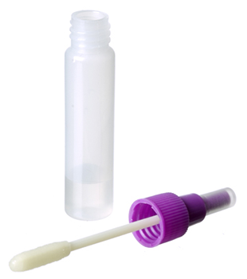

##  Draeger Surface Sampling Kit 5000

The SSK 5000 kit is used for sampling for drugs on or from surfaces. When used in combination with the DrugTest 5000 analyzer, the sample is transferred to a test cassette and screened for possible drug contamination. For further testing, the collected sample can be stored and transported.

