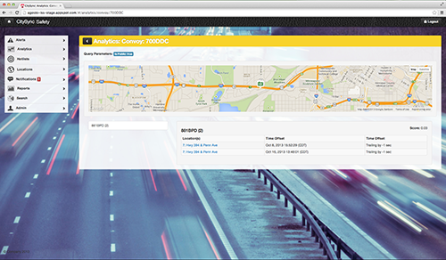

##  ImageSensing LPR: A Police Force Multiplier

**Actionable Alarms and Analytics**

As data from thousands of LPR devices are aggregated
in the CitySync back-offi ce solution, it cross-tabulates
them against multiple hot-list databases and complex
queries in order to generate the relevant, time critical
alerts and results.